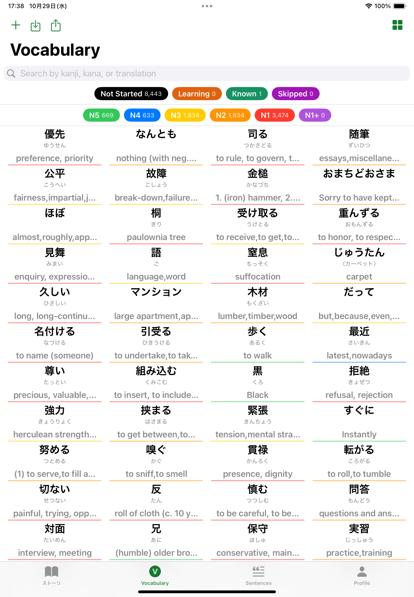
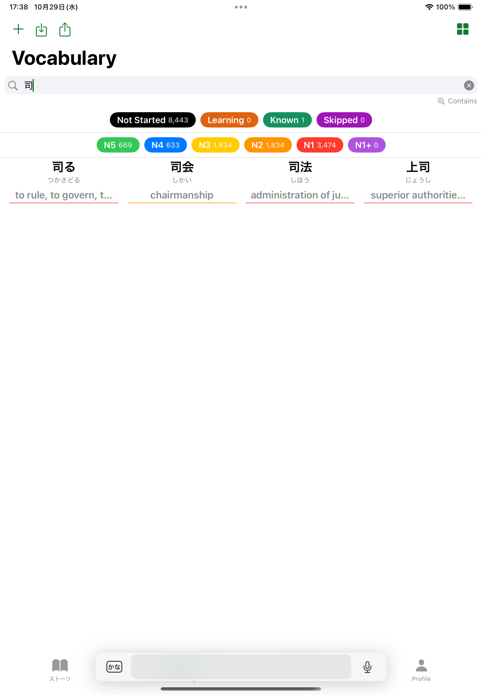
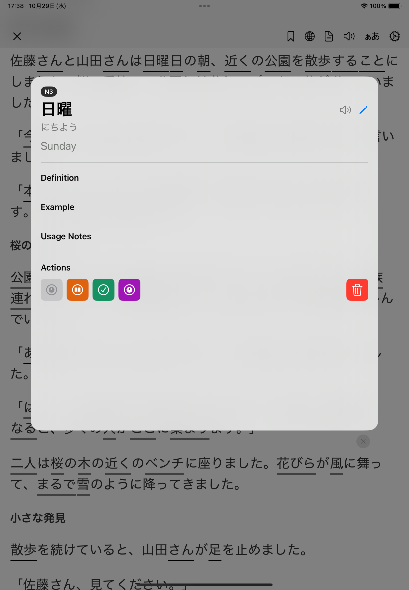

### This project is currently under active development, implementing a custom modular architecture designed for high UI stability and rapid feature evolution. This approach ensures a scalable and maintainable codebase as the app's features continue to change and expand. For these reasons, the source code is not publicly available at this time. I would be happy to walk through the implementation or share relevant code during an interview upon request.

### Update: Im reinveting this app to language learning focused product.

## New Tech Stack
- SwiftUI, UIKit, WebKit
- SwiftData
- Observation
- Combine
- NaturalLanguage
- TTS
- Translation
- AI

## Screenshot

| - | - |
| ---- | ---- |
|  |  |
|  |  |
|  | - |