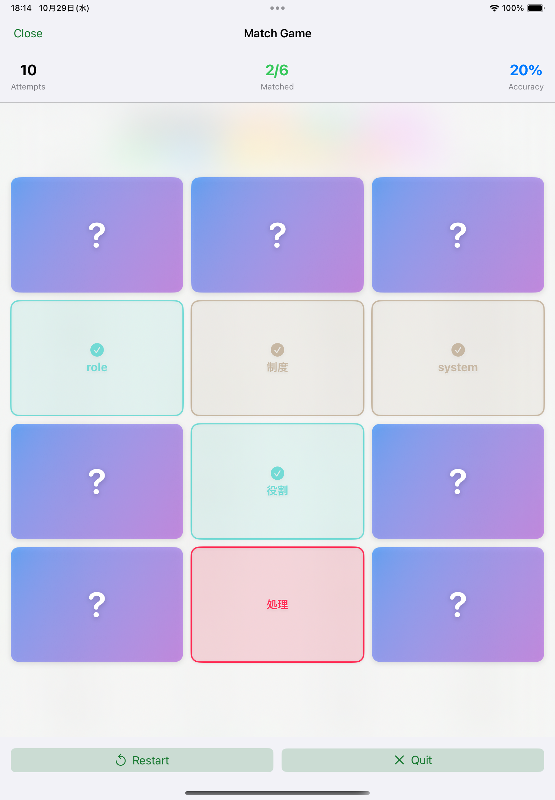

### This project is currently under active development, implementing a custom modular architecture designed for high UI stability and rapid feature evolution. This approach ensures a scalable and maintainable codebase as the app's features continue to change and expand. For these reasons, the source code is not publicly available at this time. I would be happy to walk through the implementation or share relevant code during an interview upon request.

### 本プロジェクトは現在、App Storeでのリリースを目指し、活発に開発が進められています。UIの安定性と機能の迅速な進化に対応するため、独自のモジュラーアーキテクチャを採用しています。これにより、機能が拡張・変更される際にも、スケーラブルで保守しやすいコードベースを維持しています。また機能の検証、ユーザービリティ確認での頻繁な変動の理由から、現時点ではソースコードを公開しておりませんが、ご要望に応じて、面接時に実装内容の詳細や関連コードについてご説明いたします。

### スクショ以外にも多くの機能がありますが、ユーザービリティの一貫性、整合性の為実装済みでも起用していない部分があります。

## New Tech Stack
- SwiftUI, UIKit, WebKit
- SwiftData
- Observation
- Combine
- NaturalLanguage
- TTS
- Translation
- AI
- Modular Architecture + MVVM + Custom Navigation.

## Screenshot

| - | - |
| ---- | ---- |
|  |  |
|  |  |
|  |  |