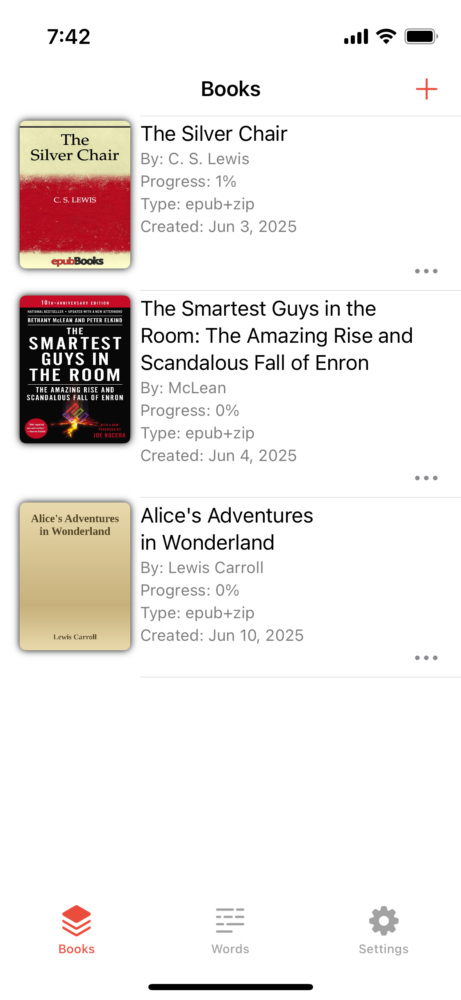
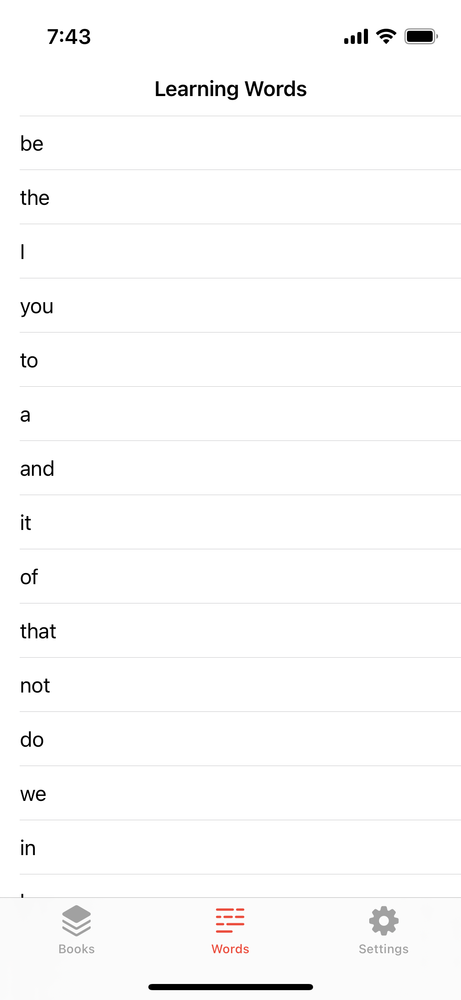
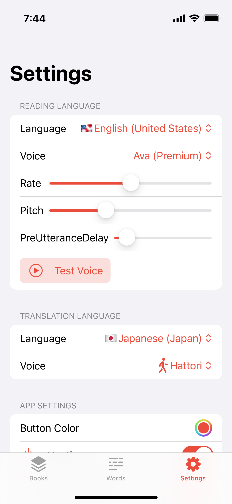
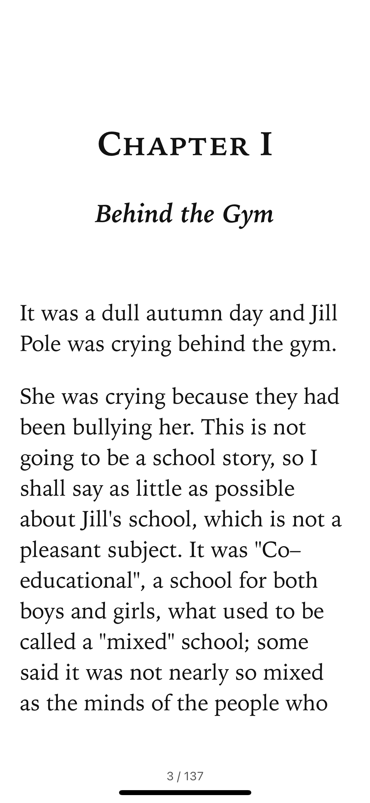
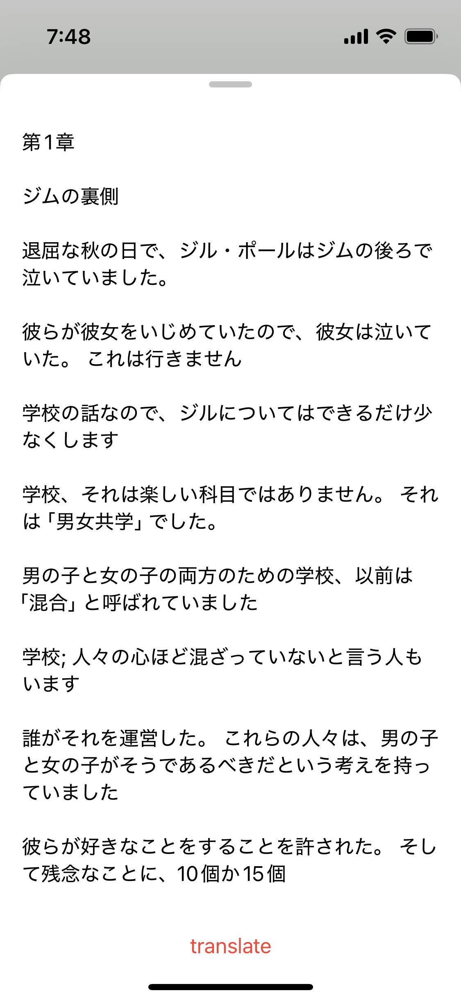
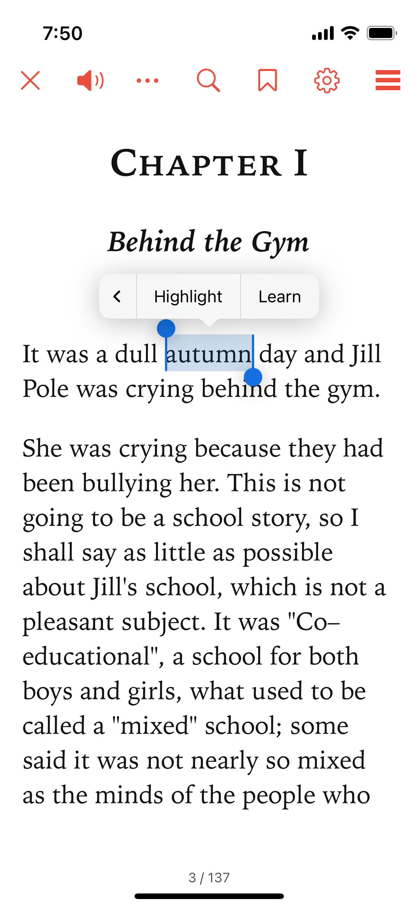

## EPUBの電子書籍に対応中、設計直し途中　（2025/04）

## プロジェクト概要

まだ進行中の個人作成アプリです。
ユーザーがローカルから英語内容の本（EPUN,PDF）をアプリに読み込み、単語分割、翻訳、読み上げできるようにしています。
単語の記憶ステータス管理ができます。（例：本を読む途中、その後）

まだ開発中とストアにリリースの為しばらくソースコードの公開はありません。

## 主な機能

- [ユーザーの書籍登録]
- [書籍内容の閲覧時の単語分割]
- [単語の記憶ステータス管理]
- [翻訳、読み上げ]

## スクリーンショット

|  |  |  |
|---------------------------------|---------------------------------|---------------------------------|
|  |  |  |

## 技術スタック
- SwiftUI
- GRDB
- Observation
- NaturalLanguage
- Readium
- AVKit
- Translation
- ...

## プログレス
now:        Tool -
            note:
important:  text extract from reader page, more presisely, only from viewport

# TODOs
- [ ] Dictionary - create dictionary data (raw)
- [ ] Dictionary - precreate dictionary database (sqlite .db)
- [ ] Dictionary - research all kind of part of speech(gutenberg and others) ---- Research
- [ ] Reader - LearningView text extract from reader page, more presisely, only from viewport
- [ ] Reader - LearningView text on page iterator
- [ ] Reader - Settings UI Research
- [x] Settings - and view
- [x] Settings - add software libraries section
- [x] Settings - Language and Voice Categorization Research
- [ ] Settings - Where to find Free E books
- [x] Settings - voices pitch and speed (source done)
- [ ] Settings - voices pitch and speed (target)
- [x] Settings - TTS: TTSViewModel need to use non global voice, language pitch, rate
- [x] Settings - TTS: AVTTSEngine - make preUtteranceDelay configurable by Settings
- [x] Tool - HapticsManager
- [x] Tool - SoundEffectManager
- [x] Tool - Alert
- [x] Tool - Logging System (SwiftyBeaver)
- [x] Tool - ThemeApplier: clean (deleted unused code for now)
- [ ] Tool - Error and Alert Handling
- [x] Tool - NLService (testing)
- [x] Book - rename
- [x] Book - States (Finished)
- [x] Book - Add default book from bundle
- [x] Book - tags (Category) (add remove)
- [ ] Book - tags LibraryView set filter menu for navigation title (by tag)
- [ ] Book - tags Book relation to tag and UI
- [ ] Book - Add Users Reading PaperBook Info for tracking
- [ ] Book - ReadiumUserPreferencesStore(for book and for shared save on database)  Understant each settings effect
- [ ] Book - importPublications (more than one)
- [ ] Wordlist - view design
- [ ] Wordlist - add sentence(database record) similar to add word x add highlight. (learning sentence)
- [ ] ProblemsFix - warnings when close in appp browser
- [X] ProblemsFix - Library forlder seems no more needed
- [ ] ProblemsFix - Japanese Vertical LtoR Epub Navigation Problem
- [x] ProblemsFix - Bookmarks and Highlights are not showing
- [ ] ProblemsFix - Reader-> User Preferences -> Theme BG Color not applying to NavigationBar some time.
- [x] ProblemsFix - Readers sheet has different button color with global tint color.
- [ ] Polish - Logging replace prints to log
- [ ] Polish - add sound effect to events
- [ ] Polish - add haptic event to buttons
- [ ] Polish - systemImage Icons
- [ ] Polish - settings add developer section
- [ ] Polish - SwiftUI Preview
- [ ] Polish - Onboarding
- [ ] Polish - App Icon
- [ ] Polish - Splash
- [ ] Polish - FOSS License json file
- [ ] Polish - FOSS License view polish
- [ ] Polish - Search View Polish
- [ ] Polish - Settings add Helper View (Show onboarding sheet?)
- [ ] Other - TextContentSpeechSynthesizer
- [ ] Other - Design System

# Research Expands
- [ ] Apple developer
- [ ] IAP https://adapty.io/blog/in-app-purchase-tutorial-for-ios/
- [ ] S,Ex String Localization
- [ ] Ex Share Extension
- [ ] Ex Open url router add Webview Router similar to Safari Router
- [ ] Ex Store AI API key to Firebasestore and use it.
- [ ] Ex Font Picker from IceCube ??

# App State
- Show users learning words only for now.

# iOS Github libs
  https://swiftpackageindex.com
  - https://github.com/dkk/WrappingHStack
  - https://www.wishkit.io/?ref=github
  - https://telemetrydeck.com
  - https://swiftpackageindex.com/
  - https://github.com/siteline/swiftui-introspect
  - https://github.com/scinfu/SwiftSoup
  - https://github.com/swiftlang/swift-markdown
  - https://github.com/SFSafeSymbols/SFSafeSymbols
  - https://github.com/RevenueCat/purchases-ios             https://www.revenuecat.com
  - https://github.com/kean/Nuke
  - https://github.com/nicklockwood/LRUCache/
  - https://github.com/evgenyneu/keychain-swift
  - https://github.com/divadretlaw/EmojiText
  - https://github.com/commonmark/cmark
  - https://github.com/Dean151/ButtonKit
  - https://github.com/mergesort/Bodega
  - https://github.com/SwiftyBeaver/SwiftyBeaver  (logger)

# Milestone
1. Reader
2. Vocab
3. Tokenize
4. Text to Speech
5. Translate
6. Setting
7. Deck
8. Quiz
9. Tracking
10. AI
