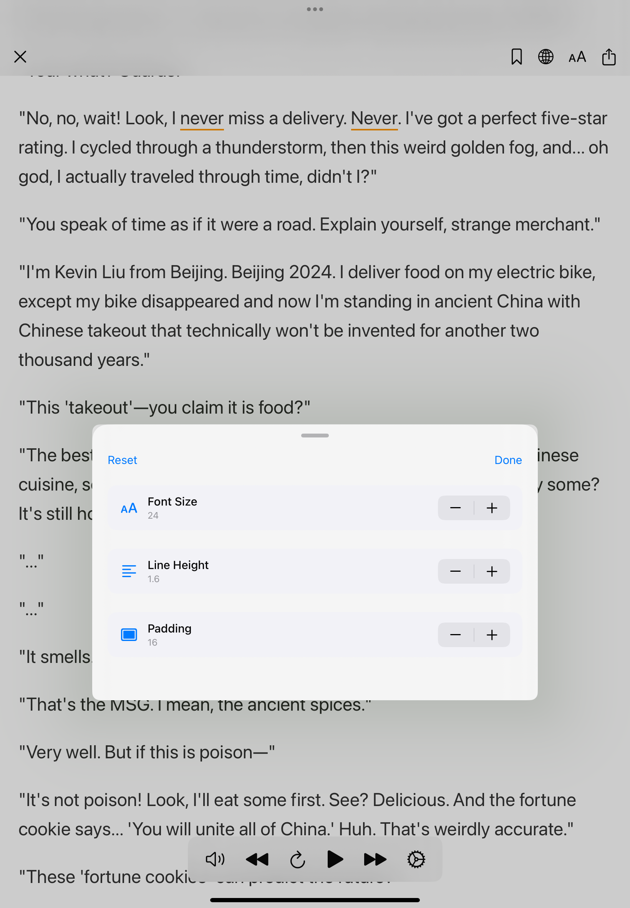
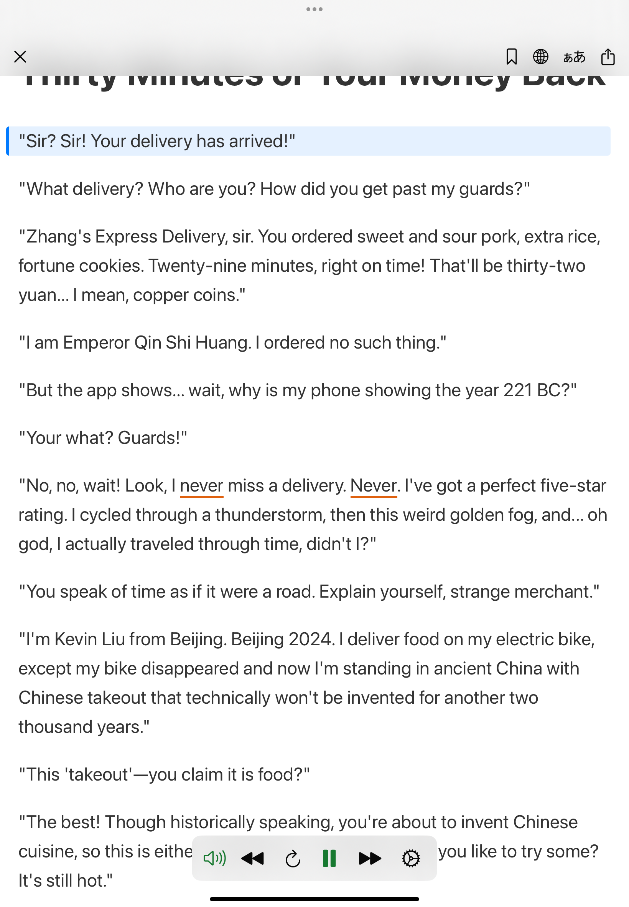

### This project is currently under active development with plans for a future App Store release. The implementation follows mobile system design best practices to ensure UI stability and development velocity as features evolve. For that reason, the source code is not publicly available at this time. However, I'd be happy to walk through the implementation or share parts of the code during an interview upon request.**

### Update: Im reinveting this app to language learning focused product.

## New Tech Stack
- SwiftUI, UIKit, WebKit
- SwiftData
- Observation
- Combine
- NaturalLanguage
- TTS
- Translation
- AI

## Screenshot

| - | - |
| ---- | ---- |
|  |  |