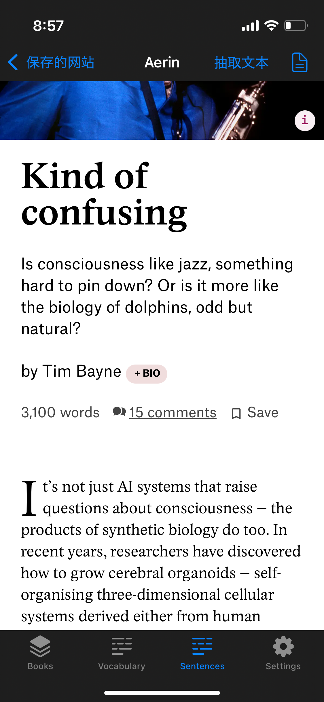

### This project is currently under active development with plans for a future App Store release. For that reason, the source code is not publicly available at this time. However, I’d be happy to walk through the implementation or share parts of the code during an interview upon request.

## Tech Stack

- SwiftUI, UIKit
- MVVM
- GRDB
- Observation
- Combine
- NaturalLanguage
- Readium
- AVKit
- Translation
- AI
- ...

## Feature
- Reader
- NaturalLanguage
- TTS (https://github.com/KaneEast/SwiftTTS)
- Translate
- AI

## Plan
- CMS
- Deck
- Quiz
- OnDevice AI

## Screenshot

| - | - | - |
| ---- | ---- | ---- |
|  |  |  |
|  |  |  |
|  |  |