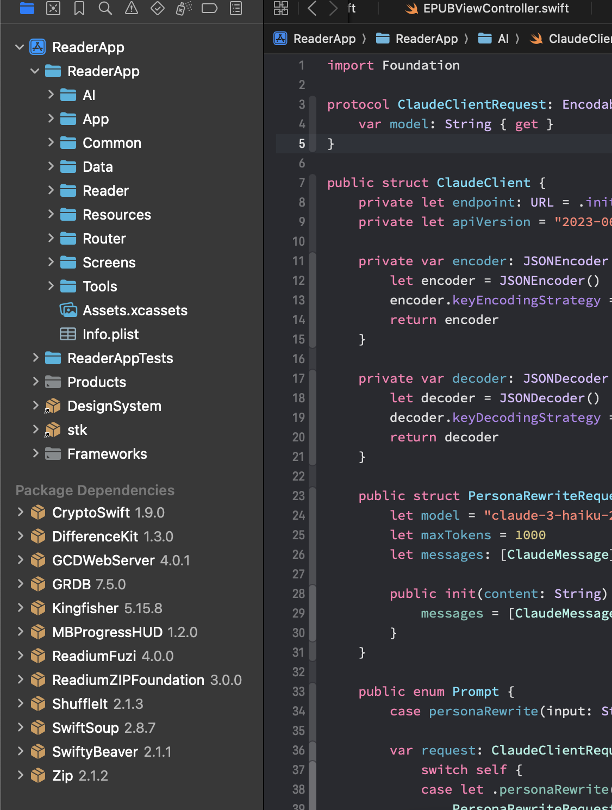

<strong>📄 Disclaimer of Use / 利用に関する免責事項（クリックで展開）</strong>

### 🇯🇵 日本語（Japanese）

本アプリは語学学習を目的とした**個人利用専用のツール**です。
書籍等の著作物の内容を処理する際は、**著作権法等の関連法令に留意し、ご自身の責任においてご使用ください**。

本アプリに搭載されている全ての機能（OCR、翻訳、音声読み上げ、語彙の出現頻度分析など）は、**すべてユーザーの端末上でローカルに実行されます**。
アプリは処理内容やデータを外部に送信・保存・分析することは一切ありません。
アプリはあくまで学習支援のための**ツール提供のみを行うものであり、使用結果についてはユーザーご自身の責任となります**。

---

### 🇬🇧 English

This app is a tool designed **solely for personal use for the purpose of language learning**.
When processing content from books or other copyrighted materials, **please use it at your own discretion and be mindful of applicable copyright laws**.

All features in this app (including OCR, translation, text-to-speech, and word frequency analysis) are **executed entirely on the user's device**.
The app does **not collect, transmit, store, or analyze** any user content externally.
It functions purely as a **local tool**, and the responsibility for how it is used rests entirely with the user.

## プロジェクト概要

まだ進行中の個人作成アプリです。
Readiumを参考、利用しています。機能追加、変更（主に英語学習機能）しています。
(オープンソースには参加していませんが余裕がある時に日本語スタイルの電子書籍のナビゲーション問題を解決しコミットする考えです。)

ユーザーがローカルから英語内容の本（EPUB,PDF）をアプリに読み込み、単語分割、翻訳、読み上げできるようにしています。
単語の記憶ステータス管理ができます。（例：本を読む途中、その後）

まだ開発中とストアにリリースの為しばらくソースコードの公開はありません。

## 主な機能

- [ユーザーの書籍登録]
- [書籍内容の閲覧時の単語分割]
- [単語の記憶ステータス管理]
- [翻訳、読み上げ]

## スクリーンショット

| - | - | - |
| ---- | ---- | ---- |
|  |  |  |
|  |  |  |
|  |  |  |
|  |  |  |
|  |  |  |
|  | - | - |

## 技術スタック

- SwiftUI, UIKit
- GRDB
- Observation
- Combine
- NaturalLanguage
- Readium
- AVKit
- Translation
- ...

# TODOs
- [ ] Dictionary - create dictionary data (raw)
- [ ] Dictionary - precreate dictionary database (sqlite .db)
- [ ] Dictionary - research all kind of part of speech(gutenberg and others) ---- Research
- [ ] Reader - LearningView text extract from reader page, more presisely, only from viewport
- [ ] Reader - LearningView text on page iterator
- [ ] Reader - Settings UI Research
- [ ] Reader - HTMLResourceContentIterator
- [ ] Reader - _HTMLResourceContentExtractor
- [ ] DB - prePorpulate condition handling
- [ ] DB - Migration Documentation
- [ ] Tracker
  - [ ] Track Users known words
  - [x] Extract words from EPub
  - [ ] Extract words from PDF
  - [ ] Words Counter
    - [ ] filtering simple basic words (definition of list not completed)
    - [ ] filtering users known words
    - [x] counting by simple words (words shown on text)
    - [x] counting by lemmatized words
    - [ ] counting - write swift test
    - [x] sorting result by count
    - [x] sorting result by alphabetic
    - [ ] sorting descending
    - [x] UI fot show result (BookAnalyzeView)
      - [ ] state controll (ignore), translate, polish (Make Batch Translation, for example if there is 4k words in the list, translate 100 words by once)
- [x] Settings - view
- [x] Settings - add software libraries section
- [x] Settings - Language and Voice Categorization Research
- [x] Settings - voices pitch and speed (source)
- [x] Settings - voices pitch and speed (target)
- [x] Settings - TTS: TTSViewModel need to use non global voice, language pitch, rate
- [x] Settings - TTS: AVTTSEngine - make preUtteranceDelay configurable by Settings
- [x] Tool - HapticsManager
- [x] Tool - SoundEffectManager
- [x] Tool - Alert
- [x] Tool - Logging System (SwiftyBeaver)
- [x] Tool - ThemeApplier: clean (deleted unused code for now)
- [ ] Tool - Error and Alert Handling
- [x] Tool - NLService (testing)
- [x] Book - rename
- [x] Book - States (Finished)
- [x] Book - Add default book from bundle
- [ ] Book - importPublications (more than one)
- [ ] Wordlist - view design
- [ ] Wordlist - add sentence(database record) similar to add word x add highlight. (learning sentence)
- [x] ProblemsFix - Translation frequently no result, or not refreshing UI. (Do not translate too long text. batch translation seems no problem)
- [ ] ProblemsFix - warnings when close in appp browser
- [ ] ProblemsFix - Japanese Vertical RtoL Epub Navigation Problem
- [x] ProblemsFix - Bookmarks and Highlights are not showing
- [ ] ProblemsFix - Reader-> User Preferences -> Theme BG Color not applying for NavigationBar some time.
- [x] ProblemsFix - Readers sheet has different button color with global tint color.
                    settings.effectiveBackgroundColor.uiColor
- [ ] ProblemsFix - Settings test speech performance
- [ ] ProblemsFix - Reader - Background Speech and Navigation when back to app problem
- [x] Polish - Logging replace prints to log
- [ ] Polish - systemImage Icons
- [ ] Polish - settings add developer section
- [ ] Polish - Onboarding
- [ ] Polish - App Icon (MU Circle)
- [x] Polish - Splash | Launch Screen | By LaunchImage (If launch Image not updates, delete app, reboot iPhone, reinstall app)
- [ ] Polish - FOSS License json file
- [ ] Polish - FOSS License view polish
- [x] Polish - Search View Polish
- [ ] Polish - Settings add Helper View (Show onboarding sheet?)
- [ ] Other - TextContentSpeechSynthesizer test
- [ ] Other - Design System

# Do later
- [x] Book - tags (Category) (add remove)
- [ ] Book - tags LibraryView set filter menu for navigation title (by tag)
- [ ] Book - tags Book relation to tag and UI
- [ ] Book - EX Add Users Reading PaperBook Info for tracking
- [ ] Polish - add sound effect to events
- [ ] Polish - add haptic event to buttons
- [ ] Polish - SwiftUI Preview
- [ ] Settings - Where to find Free E books
- [ ] Tracker - idioms, phrasal verbs...

# iOS Github libs
- Readium
- CryptoSwift
- DifferenceKit
- GCDWebServer
- GRDB
- Kingfisher
- MBProgressHUD
- Fuzi
- ZipFoundation
- SwiftSoup
- SwiftyBeaver
- Zip

# Road Map
1. Reader ✅
2. Vocab (Dictionary, Wikipedia)
3. Tokenize ✅
4. Text to Speech ✅
5. Translate (iOS 18) ✅
6. Setting ✅
7. CMS + GraphQL (Contentful + Apollo GraphQL)
8. Deck (Remember)
9. Quiz - Toeic like | Word Fitting Like Duolingo | Translation | Speech Recognize | Keboard typping
10. AI - iOS 26, Apple Inteligence, Foundation Models
