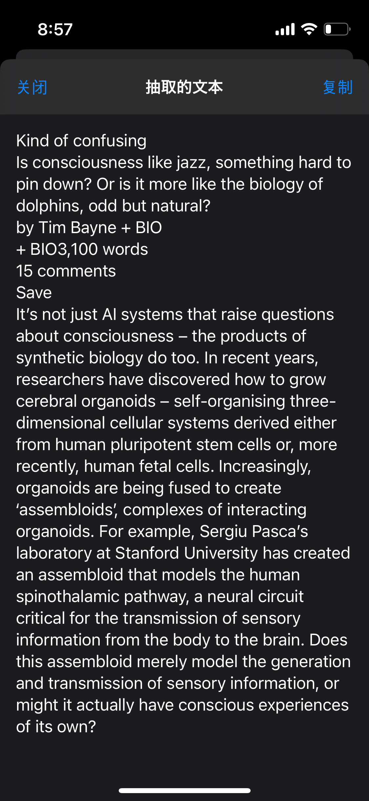
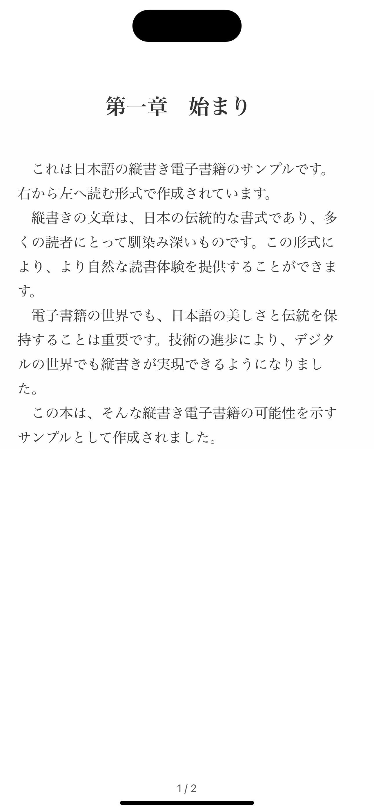

## EPUBの電子書籍に対応中、設計直し途中　（2025/04）

## プロジェクト概要

まだ進行中の個人作成アプリです。
Readiumを参考、利用しています。機能追加変更（主に英語学習機能）しています。
ユーザーがローカルから英語内容の本（EPUB,PDF）をアプリに読み込み、単語分割、翻訳、読み上げできるようにしています。
単語の記憶ステータス管理ができます。（例：本を読む途中、その後）

まだ開発中とストアにリリースの為しばらくソースコードの公開はありません。

## 主な機能

- [ユーザーの書籍登録]
- [書籍内容の閲覧時の単語分割]
- [単語の記憶ステータス管理]
- [翻訳、読み上げ]

## スクリーンショット

| - | - | - |
| ---- | ---- | ---- |
|  |  |  |
|  |  |  |
|  |  |  |
|  |  |  |

## 技術スタック

- SwiftUI, UIKit
- GRDB
- Observation
- Combine
- NaturalLanguage
- Readium
- AVKit
- Translation
- ...

# TODOs
- [ ] Dictionary - create dictionary data (raw)
- [ ] Dictionary - precreate dictionary database (sqlite .db)
- [ ] Dictionary - research all kind of part of speech(gutenberg and others) ---- Research
- [ ] Reader - LearningView text extract from reader page, more presisely, only from viewport
- [ ] Reader - LearningView text on page iterator
- [ ] Reader - Settings UI Research
- [ ] Reader - HTMLResourceContentIterator
- [ ] Reader - _HTMLResourceContentExtractor
- [ ] DB - prePorpulate condition handling
- [ ] DB - Migration Documentation
- [ ] Tracker
  - [ ] Track Users known words
  - [x] Extract words from EPub
  - [ ] Extract words from PDF
  - [ ] Words Counter
    - [ ] filtering simple basic words (definition of list not completed)
    - [ ] filtering users known words
    - [x] counting by simple words (words shown on text)
    - [x] counting by lemmatized words
    - [ ] counting - write swift test
    - [x] sorting result by count
    - [x] sorting result by alphabetic
    - [ ] sorting descending
    - [x] UI fot show result (BookAnalyzeView)
      - [ ] state controll (ignore), translate, polish (Make Batch Translation, for example if there is 4k words in the list, translate 100 words by once)
- [x] Settings - view
- [x] Settings - add software libraries section
- [x] Settings - Language and Voice Categorization Research
- [x] Settings - voices pitch and speed (source)
- [x] Settings - voices pitch and speed (target)
- [x] Settings - TTS: TTSViewModel need to use non global voice, language pitch, rate
- [x] Settings - TTS: AVTTSEngine - make preUtteranceDelay configurable by Settings
- [x] Tool - HapticsManager
- [x] Tool - SoundEffectManager
- [x] Tool - Alert
- [x] Tool - Logging System (SwiftyBeaver)
- [x] Tool - ThemeApplier: clean (deleted unused code for now)
- [ ] Tool - Error and Alert Handling
- [x] Tool - NLService (testing)
- [x] Book - rename
- [x] Book - States (Finished)
- [x] Book - Add default book from bundle
- [ ] Book - importPublications (more than one)
- [ ] Wordlist - view design
- [ ] Wordlist - add sentence(database record) similar to add word x add highlight. (learning sentence)
- [x] ProblemsFix - Translation frequently no result, or not refreshing UI. (Do not translate too long text. batch translation seems no problem)
- [ ] ProblemsFix - warnings when close in appp browser
- [ ] ProblemsFix - Japanese Vertical RtoL Epub Navigation Problem
- [x] ProblemsFix - Bookmarks and Highlights are not showing
- [ ] ProblemsFix - Reader-> User Preferences -> Theme BG Color not applying for NavigationBar some time.
- [x] ProblemsFix - Readers sheet has different button color with global tint color.
                    settings.effectiveBackgroundColor.uiColor
- [ ] ProblemsFix - Settings test speech performance
- [ ] ProblemsFix - Reader - Background Speech and Navigation when back to app problem
- [x] Polish - Logging replace prints to log
- [ ] Polish - systemImage Icons
- [ ] Polish - settings add developer section
- [ ] Polish - Onboarding
- [ ] Polish - App Icon (MU Circle)
- [x] Polish - Splash | Launch Screen | By LaunchImage (If launch Image not updates, delete app, reboot iPhone, reinstall app)
- [ ] Polish - FOSS License json file
- [ ] Polish - FOSS License view polish
- [x] Polish - Search View Polish
- [ ] Polish - Settings add Helper View (Show onboarding sheet?)
- [ ] Other - TextContentSpeechSynthesizer test
- [ ] Other - Design System

# Do later
- [x] Book - tags (Category) (add remove)
- [ ] Book - tags LibraryView set filter menu for navigation title (by tag)
- [ ] Book - tags Book relation to tag and UI
- [ ] Book - EX Add Users Reading PaperBook Info for tracking
- [ ] Polish - add sound effect to events
- [ ] Polish - add haptic event to buttons
- [ ] Polish - SwiftUI Preview
- [ ] Settings - Where to find Free E books
- [ ] Tracker - idioms, phrasal verbs...

# iOS Github libs
- Readium
- CryptoSwift
- DifferenceKit
- GCDWebServer
- GRDB
- Kingfisher
- MBProgressHUD
- Fuzi
- ZipFoundation
- SwiftSoup
- SwiftyBeaver
- Zip

# Road Map
1. Reader ✅
2. Vocab (Dictionary)
3. Tokenize ✅
4. Text to Speech ✅
5. Translate (iOS 18) ✅
6. Setting ✅
7. Tracking
8. Deck (Remember)
9. Quiz - Toeic like | Word Fitting Like Duolingo | Translation | Speech Recognize | Keboard typping
10. AI - iOS 26, Apple Inteligence, Foundation Models | AI API Services
11. Audio Book
12. CBZ Book
13. Streaming
14. Serverside Content by server or Content provider service
15. Serverside feature, User, Connection
16. Social